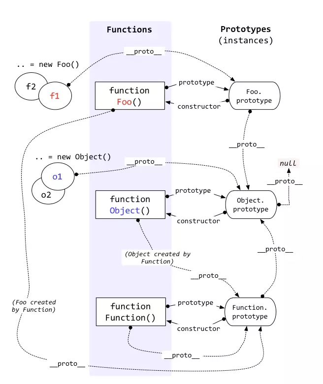

# JavaScript 原型链 与 this 指向及继承

### 原型链

对象分为普通对象和函数对象

> 普通对象

最普通的对象：具有 `__proto__` 属性并指向原型链，没有 `prototype` 属性。

原型对象：`foo.prototype`，原型对象还有 `constructor` 属性并指向构造函数对象。

> 函数对象

通过 new Function()创建的都是函数对象。有 `__proto__` , `prototype` 属性。



[JavaScript 原型链理解](https://juejin.im/post/5d133eb26fb9a07edd2a2258)

---

### this 指向

```js
// 请解释最后两行函数的值为什么不一样
var obj = {
  foo: function() {
    console.log(this);
  }
};

var bar = obj.foo;
obj.foo(); // 打印出的 this 是 obj
bar(); // 打印出的 this 是 window
```

> 函数调用

```js
// JS（ES5）里面有三种函数调用形式：
func(p1, p2);
obj.child.method(p1, p2);
func.call(context, p1, p2); // 先不讲 apply

// 第三种调用形式，才是正常调用形式
func.call(context, p1, p2);

// 解答
var bar = obj.foo;
obj.foo(); // 转换为 obj.foo.call(obj)，this 就是 obj
bar();
// 转换为 bar.call()
// 由于没有传 context
// 所以 this 就是 undefined
// 最后浏览器给你一个默认的 this —— window 对象
```

### 继承

继承的本质就是原型链

1. 借助构造函数实现继承

```js
/**
 * 借助构造函数实现继承 -- 缺点：只能继承父类的实例属性和方法，不能继承原型属性/方法
 */
function Parent1() {
  this.name = "parent1";
}

Parent1.prototype.say = function() {};

function Child1() {
  Parent1.call(this);
  this.type = "child1";
}

console.log(new Child1()); // without say()
```

2. 借助原型链实现继承

```js
/**
 * 借助原型链实现继承 -- 缺点：新增一个值 ，其他实例也跟着改变
 */
function Parent2() {
  this.name = "parent2";
  this.play = [1, 2, 3];
}

function Child2() {
  this.type = "child2";
}
Child2.prototype = new Parent2();

console.log(new Child2());

var s1 = new Child2();
var s2 = new Child2();
s1.play.push(4);
console.log(s1.play, s2.play); // (4) [1, 2, 3, 4] (4) [1, 2, 3, 4]
```

3. 组合方式实现继承

```js
/**
 * 组合方式实现继承
 *
 * 将 1 和 2 两种方式组合起来，就可以解决1和2存在问题，这种方式为组合继承。
 * 缺点：实例一个对象的时，父类 new 了两次，
 * 第一次是 var s3 = new Child3()
 * 第二次是 Child3.prototype = new Parent3()
 */
function Parent3() {
  this.name = "parent3";
  this.play = [1, 2, 3];
}

Parent3.prototype.say = function() {};

function Child3() {
  Parent3.call(this);
  this.type = "child3";
}

Child3.prototype = new Parent3();

var s3 = new Child3();
var s4 = new Child3();
s3.play.push(4);
console.log(new Child3());
console.log(s3.play, s4.play); // (4) [1, 2, 3, 4] (3) [1, 2, 3]
```

4. 组合继承的优化 1

```js
/**
 * 组合继承的优化 1
 *
 * 优化点： Child4.prototype = Parent4.prototype，
 * 通过构造函数就可以拿到所有属性和实例的方法，
 * 现在我想继承父类的原型对象，所以你直接赋值给我就行，
 * 不用在去 new 一次父类。其实这种方法还是有问题的
 *
 * 缺点：没有办法区分一个对象是直接由它的子类实例化还是父类实例化
 */
function Parent4() {
  this.name = "parent4";
  this.play = [1, 2, 3];
}

Parent4.prototype.say = function() {};

function Child4() {
  Parent4.call(this);
  this.type = "child4";
}

Child4.prototype = Parent4.prototype;

var s5 = new Child4();
var s6 = new Child4();
s5.play.push(4);
console.log(new Child4());
console.log(s5.play, s6.play); // (4) [1, 2, 3, 4] (3) [1, 2, 3]

// 问题点
s5 instanceof Child4; // true
s5 instanceof Parent4; // true
Child4.prototype.constructor
// ƒ Parent4() {
//   this.name = "parent4";
//   this.play = [1, 2, 3];
// }
```

5. 组合继承的优化 2

```js
/**
 * 组合继承的优化2
 * 
 * 缺点：子类没有定义自己的constructor
 *
 * 主要使用Object.create()，它的作用是将对象继承到__proto__属性上，
 * 举例子：
   var test = Object.create({ x: 123, y: 345 });
   console.log(test); // {}
   console.log(test.x); // 123
   console.log(test.__proto__.x); // 3
   console.log(test.__proto__.x === test.x); // true
 */
function Parent5() {
  this.name = "parent5";
  this.play = [1, 2, 3];
}

Parent5.prototype.say = function() {};

function Child5() {
  Parent5.call(this);
  this.type = "child5";
}

Child5.prototype = Object.create(Parent5.prototype);
```

> 最后要定义子类自己的 `constructor`

```js
/**
 * JS继承最终版本
 */
function Parent5() {
  this.name = "parent5";
  this.play = [1, 2, 3];
}

Parent5.prototype.say = function() {};

function Child5() {
  Parent5.call(this);
  this.type = "child5";
}

Child5.prototype = Object.create(Parent5.prototype);
Child5.prototype.constructor = Child5;
```

[JS 中 this 指向及继承](https://juejin.im/post/5cfd9d30f265da1b94213d28)
