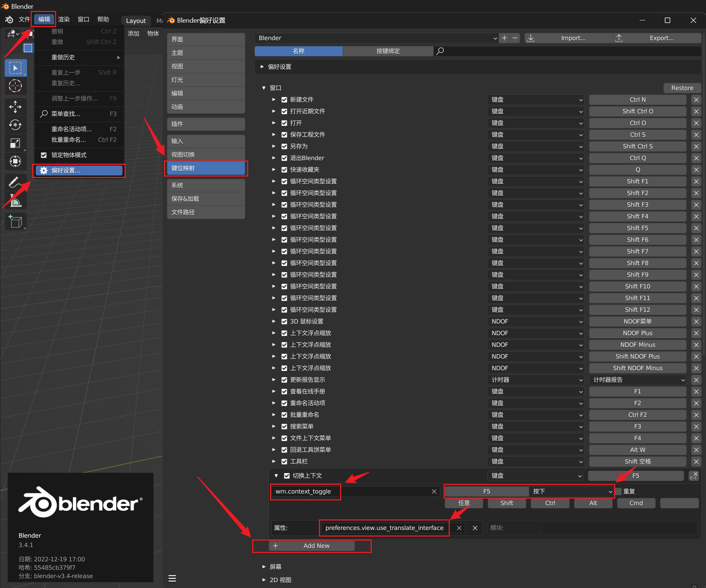

# blender 一键切换中英文界面

## blender 设置

编辑 > 设置 > 键位映射＞窗口，往下拉，点击 `Add New` 按钮，增加一个新映射

如下：



输入内容有：

```
// 识别符
wm.context_toggle

// 属性
preferences.view.use_translate_interface
```

快捷键：F5

> 可以选择你喜欢的快捷键，注意快捷键冲突

对 blender 感兴趣的同学，可以加个好友，一起学习交流

### 联系方式

QQ：695601626

微信：linbingquan695601626

## 参考资料

[blender 指南 - 快捷键](https://docs.blender.org/manual/zh-hans/3.4/advanced/keymap_editing.html#key-bindings-for-pop-ups)

[blender API](https://docs.blender.org/api/current/bpy.types.PreferencesView.html#bpy.types.PreferencesView.use_translate_interface)