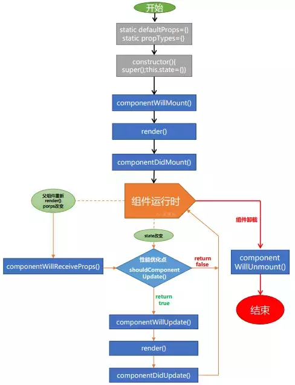

# React 生命周期(React life cycle)

```js
constructor(); // 初始化
componentWillMount(); // 初始化时只调用一次
render(); // 创建虚拟DOM
componentDidMount(); // 加载请求数据
componentWillReceiveProps(); // 常用于父子组件 子组件写这个方法函数
shouldComponentUpdate(nextProps, nextState); // 组件是否重新渲染
componentWillUnmount(); // 组件卸载时前调用 清楚事件监听和定时器
```

React 生命周期



### react hooks useReducer middlewareLog

```js
// 添加状态更改的log
function middlewareLog(lastState: any = initialState, action: any) {
  const type = action.type.split("_")[0].toLowerCase();
  const nextState = reducer[type](lastState, action);
  console.log(
    `%c|------- redux: ${action.type} -------|`,
    `background: rgb(70, 70, 70); color: rgb(240, 235, 200); width:100%;`
  );
  console.log("|--last: ", lastState);
  console.log("|--next: ", nextState);
  return nextState;
}
```
