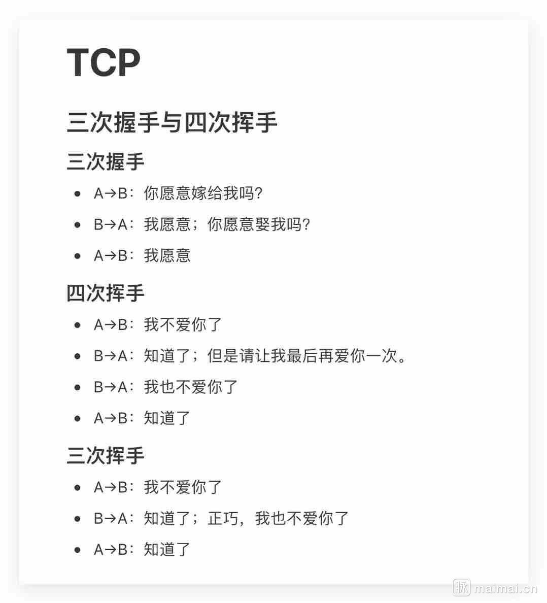

# TCP 和 UDP

TCP 为什么握手三次、挥手四次？

[跟着动画来学习 TCP 三次握手和四次挥手](https://juejin.im/post/5b29d2c4e51d4558b80b1d8c)

[图解 TCP 三次握手与四次分手](https://juejin.im/post/5a7835a46fb9a063606eb801)

[就是要你懂 TCP](http://jm.taobao.org/2017/06/08/20170608/)

---

[TCP 和 UDP 比较](https://juejin.im/post/5c6fbf54f265da2db718216a)

[TCP 和 UDP](https://juejin.im/post/583d2d6a67f356006bb7d535)

---

[HTTP3 为什么比 HTTP2 靠谱？](http://www.sohu.com/a/299243519_115128)

[HTTP/3 将弃用 TCP](http://www.sohu.com/a/283000685_231667)
