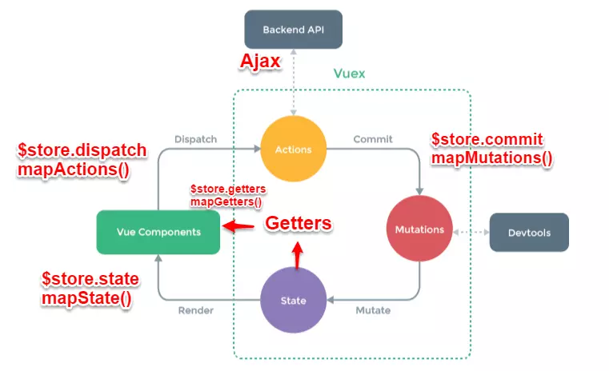

# Vue 组件间通信六种方式

## 方法一 `props/$emit`

### 父组件向子组件传值（通过 props 向下传递）

> 组件中的数据共有三种形式：data、props、computed

```html
<!-- 父组件 Parent.vue -->
<template>
  <div class="Parent">
    <Child v-bind:data="datas" />
  </div>
</template>
<script>
  import Child from "./components/Child";
  export default {
    data() {
      return {
        datas: ["张三", "李四", "王五"]
      };
    },
    components: {
      Child
    }
  };
</script>

<!-- 子组件 Child.vue -->
<template>
  <div v-for="data in datas">{{ data }}</div>
</template>
<script>
  export default {
    props: {
      datas: {
        type: Array,
        required: true
      }
    }
  };
</script>
```

### 子组件向父组件传值（通过事件形式）

```html
<!-- 子组件 Child.vue -->
<template>
  <div @click="handleClick">Child</div>
</template>
<script>
  export default {
    methods: {
      handleClick() {
        this.$emit("handleChildEmit", "子向父组件传值");
      }
    }
  };
</script>

<!-- 父组件 Parent.vue -->
<template>
  <div class="Parent">
    <Child v-on:handleChildEmit="handleChildEmit" />
  </div>
</template>
<script>
  import Child from "./components/Child";
  export default {
    methods: {
      handleChildEmit(e) {
        console.log(e);
      }
    },
    components: {
      Child
    }
  };
</script>
```

## 方法二 `$emit/$on`

通过一个空的 Vue 实例作为中央事件总线（事件中心），用它来触发事件和监听事件,巧妙而轻量地实现了任何组件间的通信，包括父子、兄弟、跨级。

> 项目比较大时，可以选择更好的状态管理解决方案 vuex。

> 监听了自定义事件, 因为有时不确定何时会触发事件，一般会在 mounted 或 created 钩子中来监听。

```js
// 具体实现方式
var Event = new Vue();
Event.$emit(事件名, 数据);
Event.$on(事件名, data => {});
```

```html
<div id="root">
  <ComponentA />
  <ComponentB />
  <ComponentC />
</div>

<template id="ComponentA">
  <div>
    <h3>A组件</h3>
    <button @click="send">将数据发送给C组件</button>
  </div>
</template>

<template id="ComponentB">
  <div>
    <h3>B组件</h3>
    <button @click="send">将数据发送给C组件</button>
  </div>
</template>

<template id="ComponentC">
  <div>
    <h3>C组件</h3>
    <div>{{data-a}} {{data-b}}</div>
  </div>
</template>

<script>
  var Event = new Vue(); //定义一个空的Vue实例

  var ComponentA = {
    template: "#ComponentA",
    data() {
      return {
        data: "dataA"
      };
    },
    methods: {
      send() {
        Event.$emit("data-a", this.data);
      }
    }
  };
  var ComponentB = {
    template: "#ComponentB",
    data() {
      return {
        data: "dataB"
      };
    },
    methods: {
      send() {
        Event.$emit("data-b", this.data);
      }
    }
  };

  var ComponentC = {
    template: "#ComponentC",
    data() {
      return {
        dataA: "",
        dataB: ""
      };
    },
    mounted() {
      //在模板编译完成后执行
      Event.$on("data-a", dataA => {
        this.dataA = dataA; //箭头函数内部不会产生新的this，这边如果不用=>,this指代Event
      });
      Event.$on("data-b", dataB => {
        this.dataB = dataB;
      });
    }
  };

  var vm = new Vue({
    el: "#root",
    components: {
      CompoentA: A,
      CompoentB: B,
      CompoentC: C
    }
  });
</script>
```

## 方法三 `vuex`



> Vuex 实现了一个单向数据流，在全局拥有一个 State 存放数据，当组件要更改 State 中的数据时，必须通过 Mutation 进行，Mutation 同时提供了订阅者模式供外部插件调用获取 State 数据的更新。而当所有异步操作(常见于调用后端接口异步获取更新数据)或批量的同步操作需要走 Action，但 Action 也是无法直接修改 State 的，还是需要通过 Mutation 来修改 State 的数据。最后，根据 State 的变化，渲染到视图上。

- Vue Components：Vue 组件。HTML 页面上，负责接收用户操作等交互行为，执行 `dispatch` 方法触发对应 `action` 进行回应。
- `dispatch`：操作行为触发方法，是唯一能执行 action 的方法。
- `actions`：操作行为处理模块,由组件中的`$store.dispatch('action 名称', data1)`来触发。然后由 commit()来触发 `mutation` 的调用 , 间接更新 state。负责处理 Vue Components 接收到的所有交互行为。包含同步/异步操作，支持多个同名方法，按照注册的顺序依次触发。向后台 API 请求的操作就在这个模块中进行，包括触发其他 `action` 以及提交 `mutation` 的操作。该模块提供了 Promise 的封装，以支持 action 的链式触发。
- `commit`：状态改变提交操作方法。对 `mutation` 进行提交，是唯一能执行 mutation 的方法。
- `mutations`：状态改变操作方法，由 `actions` 中的 `commit('mutation 名称')`来触发。是 Vuex 修改 state 的唯一推荐方法。该方法只能进行同步操作，且方法名只能全局唯一。操作之中会有一些 hook 暴露出来，以进行 `state` 的监控等。
- `state`：页面状态管理容器对象。集中存储 Vue components 中 data 对象的零散数据，全局唯一，以进行统一的状态管理。页面显示所需的数据从该对象中进行读取，利用 Vue 的细粒度数据响应机制来进行高效的状态更新。
- `getters`：`state` 对象读取方法。图中没有单独列出该模块，应该被包含在了 render 中，Vue Components 通过该方法读取全局 `state` 对象。

`Vuex` 存储的数据是响应式的。但是并不会保存起来可以利用 `localStorage`

```js
let defaultVal = "上海";
try {
  // 用户关闭了本地存储功能，此时在外层加个try...catch
  if (!defaultVal) {
    defaultVal = JSON.parse(window.localStorage.getItem("defaultVal"));
  }
} catch (e) {}
export default new Vuex.Store({
  state: {
    a: defaultVal
  },
  mutations: {
    changeVal(state, a) {
      state.a = a;
      try {
        // 数据改变的时候把数据拷贝一份保存到localStorage里面
        window.localStorage.setItem("defaultVal", JSON.stringify(state.a));
      } catch (e) {}
    }
  }
});
```

## 方法四 `$attrs/$listeners`

多级组件传递数据时，如果仅仅是传递数据，而不做中间处理，建议用`$attrs/$listeners`

`$attrs`：包含了父作用域中不作为 `prop` 被识别 (且获取) 的特性绑定 (`class` 和 `style` 除外)。当一个组件没有声明任何 prop 时，这里会包含所有父作用域的绑定 (`class` 和 `style` 除外)，并且可以通过 `v-bind="$attrs"` 传入内部组件——在创建高级别的组件时非常有用。

`$listeners`：包含了父作用域中的 (不含 .native 修饰器的) `v-on` 事件监听器。它可以通过 `v-on="$listeners"`传入内部组件——在创建更高层次的组件时非常有用。

简单来说：

- `$attrs` 里存放的是父组件中绑定的非 Props 属性，
- `$listeners`里存放的是父组件中绑定的非原生事件。

## 方法五 `provide/inject`

```js
// 父级组件提供 'foo'
var Provider = {
  provide: {
    foo: "bar"
  }
  // ...
};

// 子组件注入 'foo'
var Child = {
  inject: ["foo"],
  created() {
    console.log(this.foo); // => "bar"
  }
  // ...
};
```

## 方法六 `$parent / $children 与 ref`

- `ref`：如果在普通的 DOM 元素上使用，引用指向的就是 DOM 元素；如果用在子组件上，引用就指向组件实例
- `$parent / $children`：访问父 / 子实例

这两种都是直接得到组件实例，使用后可以直接调用组件的方法或访问数据

这两种方法的弊端是，无法在跨级或兄弟间通信。

---

### 常见使用场景可以分为三类：

- 父子通信：父向子传递数据是通过 props，子向父是通过 events（$emit）；通过父链 / 子链也可以通信（$parent / $children）；ref 也可以访问组件实例；provide / inject API；$attrs/\$listeners
- 兄弟通信：Bus；Vuex
- 跨级通信：Bus；Vuex；provide / inject API、$attrs/\$listeners

[Vue 组件间通信六种方式（完整版）](https://juejin.im/post/5cde0b43f265da03867e78d3)
