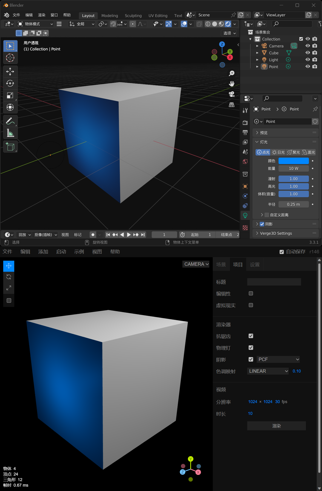

# WebGL 所见即所得

> blender v3.3.1 three.js r146



```js
renderer.outputEncoding = THREE.sRGBEncoding;
renderer.physicallyCorrectLights = true;
renderer.toneMapping = THREE.LinearToneMapping;
renderer.toneMappingExposure = 0.1;
```

#### 链接

[blender](https://www.blender.org/)

[three.js](https://threejs.org)
